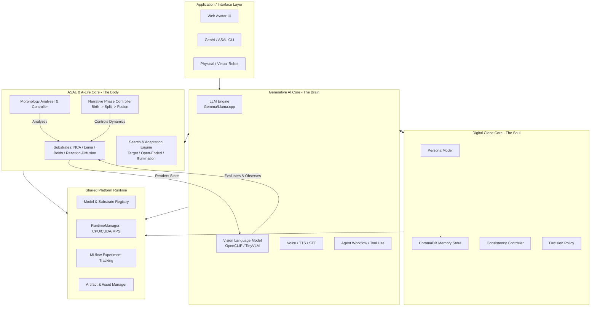

# 28_ALIFE_UNIFIED_ARCHITECTURE_V2

## 1. 願景與定位 (Vision & Positioning)

本文件基於先前的架構規劃 (01~27) 以及最新的前瞻 Artificial Life 研究 (包含 Neural Cellular Automata, Lenia, 與 Neural Particle Automata)，提出 ALife-Platform 第二代統一架構 (Unified Architecture V2)。

我們的核心目標是建立一個「具身化的人工智慧 (Embodied AI) 與人工生命 (Artificial Life)」共生平台，讓數位個體不僅有記憶與對話能力，更擁有可演化、具備形態發生 (Morphogenesis) 能力的數位肉身。

### 三大支柱 (The Three Pillars)

1. **Digital Clone (數位分身層 - Identity & Memory)**
   負責維持個體的一致性 (Consistency)、長期記憶 (Memory) 以及人格設定 (Persona)。它是數位生命不變的靈魂。
2. **Generative AI (生成認知層 - Cognition & Perception)**
   提供多模態感知與表達能力 (LLM / VLM / TTS / STT)，負責對話生成與環境觀察，作為系統的大腦與感官。
3. **ASAL / A-Life (人工生命層 - Embodiment & Dynamics)**
   提供基於神經細胞自動機 (NCA)、Lenia 或粒子系統 (Particle Automata) 的數位物理肉身。負責產生形態演化 (Evolution) 與動態物理互動 (Narrative Dynamics)。

---

## 2. 核心架構圖 (Core Architecture)

---

## 3. 三大支柱的深度整合機制 (Deep Integration Mechanisms)

### 3.1 Digital Clone + GenAI = 「具備連貫靈魂的對話個體」
根據 `23~27` 的 Gemma4 視覺對話代理與 Web Avatar 規劃：
- **認知引擎**：使用 Llama.cpp 運行的 Gemma 模型作為核心推理與對話生成引擎。
- **記憶檢索 (Memory RAG)**：Digital Clone 利用 `ChromaDBStore` 將歷史對話與 Persona 設定向量化，並在每次 GenAI 生成回覆前進行 RAG 檢索，確保人設與記憶的一致性。
- **多模態互動**：整合 Voice (語音生成/辨識) 與 Web Avatar 狀態機，讓系統能聽、能看 (透過 VLM 視覺感知)、能說。

### 3.2 GenAI + ASAL = 「具備高階評估者的演化系統」
根據 ASAL 的核心論文與我們的 Phase 0/1 實作：
- **AI 裁判與觀察者 (AI Judge / Observer)**：ASAL 不依賴傳統寫死的適應度函數 (Fitness Function)，而是呼叫 GenAI 層的 **VLM (如 OpenCLIP, TinyVLM)** 進行語義與視覺評分。例如，評估一團演化中的細胞粒子是否在視覺上符合 "a biological cell"。
- **主動干預 (Active Interventions)**：未來 LLM 可以不只是評分，還能基於分析結果主動修改 ASAL 的 `Narrative Config`，引導演化方向。

### 3.3 Digital Clone + ASAL = 「擁有形態與生命週期的數位實體」
融合 NCA (Neural Cellular Automata) 與 Neural Particle Automata 前沿理論：
- **形態發生 (Morphogenesis)**：Digital Clone 不再只是一串文本 Prompt，它擁有一個在 ASAL 系統中運行的「底材 (Substrate)」。這個分身可以在背景以 Lenia 或 NCA 的形式自我組織、生長 (Grow) 並維持穩定的生命形態。
- **動態敘事控制 (Narrative Control)**：根據 `20~22` 的敘事細胞融合設計，數位生命可以根據對話狀態或內部情感，經歷 **Birth (誕生) -> Split (分裂/思考) -> Fusion (融合/收斂)** 的物理模擬變化，讓數位生命具備真實的視覺行為張力。

---

## 4. 下世代人工生命底材 (Next-Gen Substrates)

依據文獻回顧 (包含 NCA, Particle Automata, Lenia)，我們將 `research/asal_engine/substrates` 的發展路徑擴展為：

1. **Grid-based Continuous CA (Lenia)**：
   負責產生多樣化、類似微觀生物的湧現形態，適合作為開放式搜尋 (Open-Ended Search) 的基準測試。
2. **Neural Cellular Automata (NCA)**：
   具備可微分、可訓練的生長 (Morphogenesis) 與修復 (Regeneration) 能力 (涵蓋 Growing / Steerable NCA)。這使得我們能訓練出具備特定結構的數位個體。
3. **Neural Particle Automata / Particle Life**：
   打破網格限制，允許個體自由移動與自組織。這將是最終 Web Avatar 視覺表現與 Embodied AI 動力學模擬的最佳底層。
