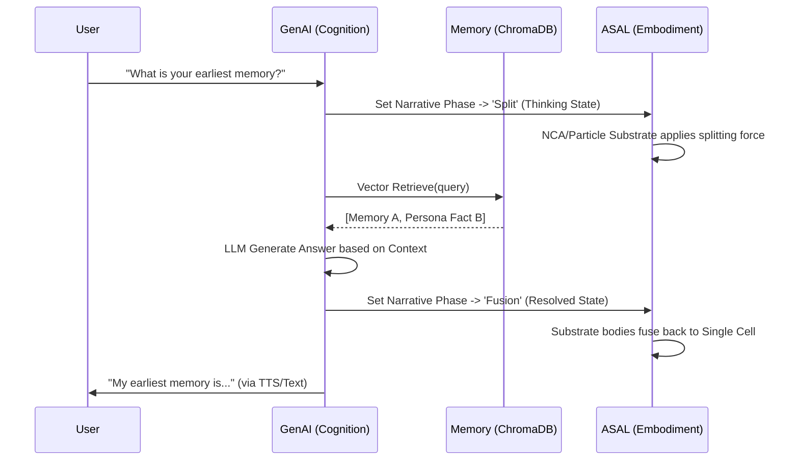

# 29_ALIFE_TECHNICAL_INTEGRATION_SPEC

## 1. 目的 (Purpose)

本文件延續 `28_ALIFE_UNIFIED_ARCHITECTURE_V2`，詳細定義程式碼層級的整合策略、資料流 (Data Flow)、以及三大核心模組 (Digital Clone, GenAI, ASAL) 之間如何透過 Shared Platform Runtime 實現低耦合、高內聚的資源共享。

---

## 2. 模組邊界與依賴關係 (Module Boundaries & Dependencies)

我們嚴格遵守以下 **依賴反轉原則 (Dependency Inversion Principle)**：
- `core/` 層 (Runtime, Registry, Tracking, Storage) 作為最底層，不依賴任何上層業務邏輯。
- `foundation_models/` 註冊於 `core/`，並封裝各種預訓練模型 (OpenCLIP, TinyVLM, LLM)。
- `research/asal_engine/`、`digital_clone/` 與 `genai/` 皆為**平行**模組，統一透過 `core/registry.py` 取得共用資源實例。

### 建議的目錄結構演進

```text
ALife-Platform/
├── core/                  # RuntimeManager, ChromaDB, MLflowTracker, Config
├── foundation_models/     # OpenCLIP Adapter, TinyVLM (Moondream), LLM Adapters
├── substrates/            # (New/Planned) 將物理底材 (Boids, Lenia, NCA) 提升為系統層級
├── research/
│   └── asal_engine/       # 專注於 ASAL Search Engine, Narrative Scoring, Morphology
├── digital_clone/         # Persona, MemoryStore (Vector DB), Consistency Controller
├── genai/                 # LLM Adapter, Web Avatar, Voice State Machine
└── apps/                  # 整合應用入口 (genai_cli.py, gemma_web.py, asal_cli.py)
```

---

## 3. 核心技術整合規劃 (Technical Integration Strategies)

### 3.1 跨模組共享的 Foundation Models (VLM/LLM)

目前的 `foundation_models/` 已經具備 OpenCLIP 的整合。
**接下來的技術實施動作**：
1. **抽離 LLM Adapter**：將 GenAI 的 LLM 封裝 (如 Llama.cpp backend) 註冊進 `foundation_models`，使 Digital Clone 與 ASAL 皆可輕易調用。
2. **引入真實 TinyVLM**：替換目前的 `tiny_vlm_stub`，實作真正的小型 VLM (例如 Moondream)，以支撐 ASAL 的 Morphology 精細判斷與 Digital Clone Web Avatar 的視覺感知。

```python
# 統一的註冊與調用介面範例
vlm = foundation_models.create("tiny_vlm_moondream", device=runtime.device)

# ASAL 使用 VLM 進行形態或語義評分
score = vlm.img_embed(rendered_frame)

# GenAI Web Avatar 使用 VLM 理解環境或使用者攝像頭
description = vlm.generate_description(camera_frame)
```

### 3.2 敘事動態控制 (Narrative Control) 與認知狀態綁定

依據 `20~22` 的規劃，ASAL 具備了 Phase Controller (Birth -> Split -> Fusion)。我們將把此物理表現與 GenAI/Digital Clone 的「內部思考狀態」進行深度綁定。

**與 Digital Clone 的連動設計**：
- **聆聽與發呆 (Idle/Listening)**：觸發 ASAL Substrate 進入 `Birth/Single` Phase，呈現穩定且輕微波動的單一細胞實體。
- **記憶檢索與思考 (Thinking/RAG)**：當 Digital Clone 進行 ChromaDB 檢索與 LLM 推理時，觸發 ASAL 進入 `Split` Phase，物理底層分裂成多個群集或粒子，視覺化「尋找與思考」的過程。
- **回答生成 (Speaking)**：觸發 `Fusion` Phase，粒子重新收斂為一個完整的實體，並伴隨 TTS 語音輸出。

這將徹底實現**「數位思維的物理具象化 (Physical Embodiment of Digital Thoughts)」**。

### 3.3 狀態與記憶資料流 (Data Flow of State & Memory)

以下是整合了對話、記憶檢索與物理形態變化的完整流程：



### 3.4 底材擴展 (Substrate Expansion)

未來的演化不再僅限於 Boids：
- **NCA (Neural Cellular Automata)** 模型權重將透過 `core/artifacts.py` 及 `core/tracking.py` 進行版本管理與載入。
- **統一 Substrate 介面**：確保所有的物理底材 (Boids, Lenia, NCA, Reaction-Diffusion) 都實作相同的 `reset(theta)`, `step(substeps)`, `render()` 以及新增的 `configure_narrative(steps, phases)` 介面，讓上層的 AI Judge 與 Web Avatar 可以無縫切換視覺呈現。

---

## 4. 開發實施路徑 (Execution Phases)

我們將依循以下階段逐步落實這份整合架構：

### 第一階段：感知與底材升級 (The Perception & Body Phase)
1. 移除 `tiny_vlm_stub`，替換為支援真實視覺理解的輕量級 VLM (Moondream)。
2. 實作並驗證 `20/21/22` 規劃的 Boids Narrative Controller (Birth/Split/Fusion) 機制。
3. 在 `substrates/` 模組下導入基礎的 `NCA` 或 `Lenia` 模型，確保其相容於現有的 ASAL 演化流程。

### 第二階段：認知與記憶整合 (The Cognition & Soul Phase)
1. 將 Digital Clone 的 `ChromaDB` 記憶模組與 GenAI 的 `Llama.cpp/Gemma` 對話推理引擎深度對接。
2. 完善 RAG-based Persona Prompting 工作流，確保回答的一致性。
3. 確保 GenAI Web Avatar / CLI 能順暢運行並展示內部認知狀態 (Idle, Listening, Thinking, Speaking)。

### 第三階段：終極具身化 (The Embodied Synthesis Phase)
1. 將 ASAL 引擎即時渲染的形態畫面 (Morphology Render) 串接至 Web Avatar UI。
2. 將 GenAI 的內部認知狀態機直接綁定到 ASAL 的 Narrative Phase Controller (觸發 Split 與 Fusion 物理效果)。
3. 利用 VLM 對整體的「對話與視覺表現」進行高階評測與回饋。
